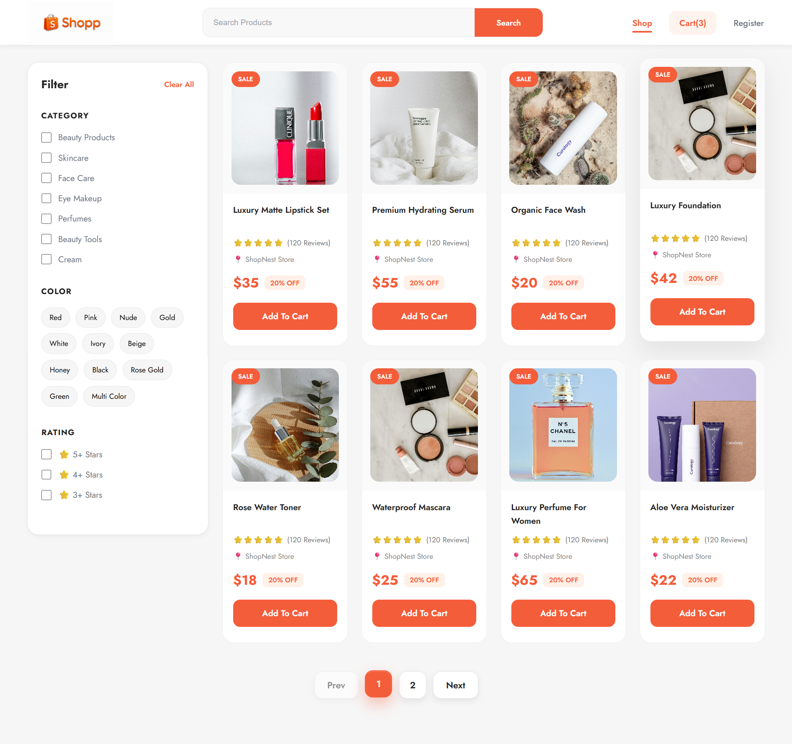
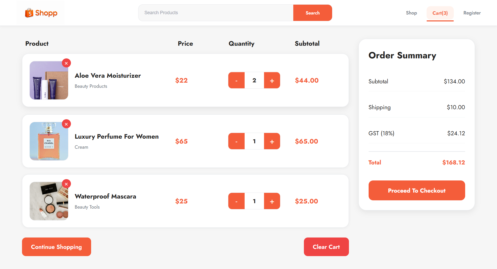
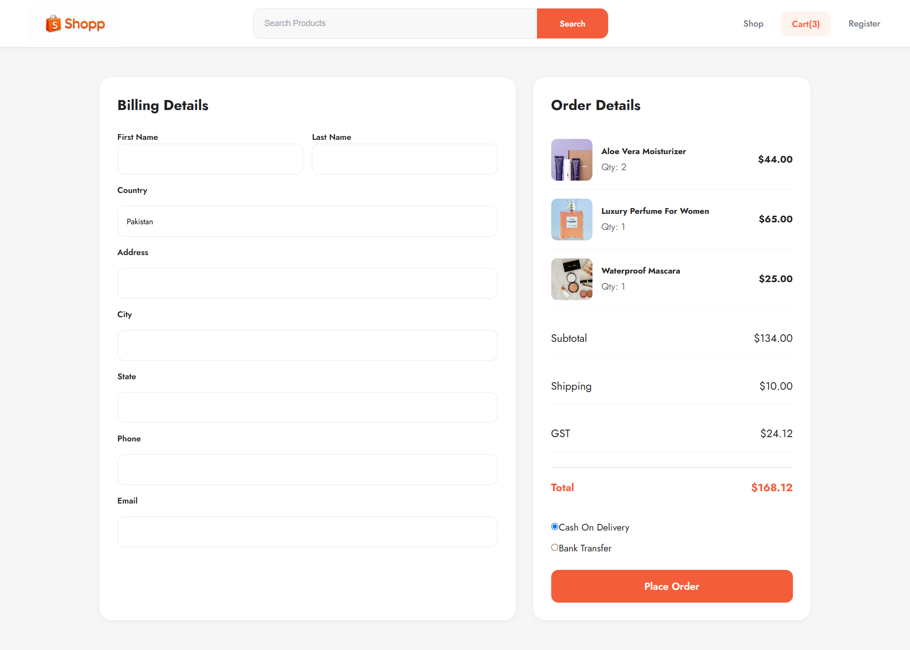
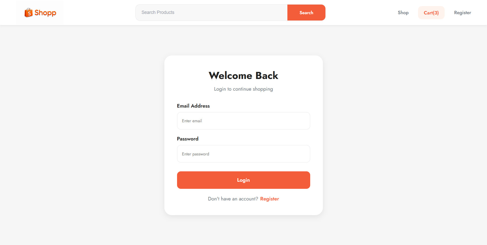
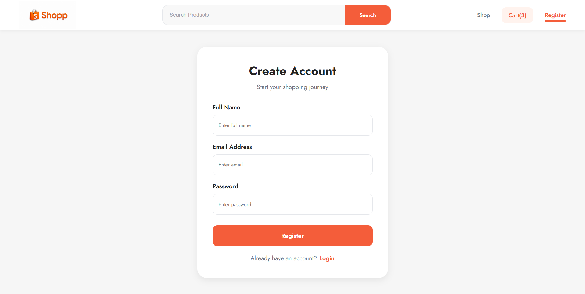

# 🛒 Modern MERN E-Commerce Platform

A fully responsive MERN Stack E-Commerce application built with React.js, Redux Toolkit, RTK Query, Node.js, Express.js, MongoDB, JWT Authentication, and Nodemailer.

This project demonstrates a complete E-Commerce workflow including authentication, cart management, checkout process, order placement, email notifications, and order history tracking.

---

## 🚀 Live Features

### 🔐 Authentication

- User Registration
- User Login
- JWT Authentication
- Protected Checkout Route
- Persistent Login State

### 🛍 Products

- Product Listing
- Product Cards
- Category Filtering
- Rating Filtering
- Pagination
- Responsive Product Grid

### 🛒 Shopping Cart

- Add To Cart
- Remove From Cart
- Increase Quantity
- Decrease Quantity
- Clear Cart
- Cart Persistence Using LocalStorage

### 💳 Checkout

- Billing Details Form
- Order Summary
- Shipping Charges
- GST Calculation
- Protected Checkout Flow

### 📦 Orders

- Place Order
- Save Orders To MongoDB
- My Orders Page
- Order History
- Order Tracking

### 📧 Email Notifications

- Admin Receives Email When New Order Is Placed
- Customer Order Details Included In Email

### 🎨 UI/UX

- Fully Responsive Design
- Mobile Friendly Layout
- Modern E-Commerce UI
- Custom CSS
- Jost Font Family

---

# 🛠 Tech Stack

## Frontend

- React.js
- React Router DOM
- Redux Toolkit
- RTK Query
- Axios
- Custom Hooks
- CSS3

## Backend

- Node.js
- Express.js
- MongoDB
- Mongoose
- JWT Authentication
- BcryptJS
- Nodemailer

---

# ⚡ Redux Toolkit Implementation

This project uses Redux Toolkit for global state management.

### Cart Slice

Handles:

- Add To Cart
- Remove From Cart
- Increase Quantity
- Decrease Quantity
- Clear Cart
- LocalStorage Persistence

### Auth Slice

Handles:

- Login State
- Logout State
- User Information
- Authentication Status

### RTK Query

Handles:

- Product Fetching
- Order Creation
- My Orders Fetching
- API Loading States
- API Error Handling
- API Caching

---

# 🔄 Project Flow

### User Journey

Register
↓
Login
↓
Browse Products
↓
Add Products To Cart
↓
Cart Page
↓
Checkout Page
↓
Place Order
↓
Order Saved In MongoDB
↓
Admin Receives Email
↓
My Orders Page

---

# 📸 Screenshots

## Product Listing

---

## Shopping Cart

---

## Checkout Page

---

## Login Page

---

## Register Page

---

# 📂 Project Structure

frontend/
│
├── components/
├── pages/
├── redux/
│ ├── auth/
│ ├── cart/
│ ├── products/
│ └── orders/
├── hooks/
├── api/
└── assets/

backend/
│
├── controllers/
├── models/
├── routes/
├── middleware/
├── config/
├── utils/
└── server.js

---

# 🔑 Environment Variables

### Backend

PORT=5000

MONGO_URI=YOUR_MONGODB_URI

JWT_SECRET=YOUR_SECRET_KEY

EMAIL_USER=YOUR_EMAIL

EMAIL_PASS=YOUR_APP_PASSWORD

ADMIN_EMAIL=YOUR_ADMIN_EMAIL

---

### Frontend

VITE_API_URL=http://localhost:5000/api

---

# Installation

## Clone Repository

git clone YOUR_REPOSITORY_URL

---

## Install Frontend

cd frontend

npm install

npm run dev

---

## Install Backend

cd backend

npm install

npm run dev

---

# 🎯 Key Learning Outcomes

- Redux Toolkit State Management
- RTK Query Data Fetching
- JWT Authentication
- Axios Interceptors
- Protected Routes
- MongoDB Data Modeling
- Email Notifications
- Responsive Design
- MERN Stack Architecture
- Real World E-Commerce Workflow

---

# 👨‍💻 Author

Javid Rahman

Frontend React.js Developer

Passionate About Building Modern Web Applications Using React.js, Redux Toolkit, JavaScript, and MERN Stack.

---

⭐ If you found this project useful, don't forget to give it a star.
